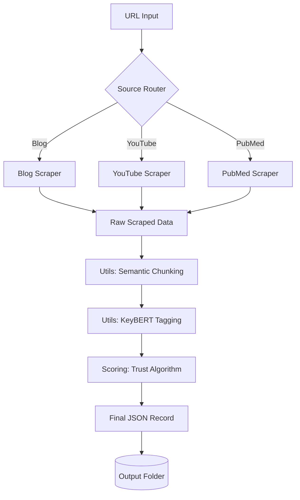

# 🏗 System Architecture

This document provides a high-level overview of the JettyAI Tasks repository architecture, comparing the initial prototype with the production-grade modular system.

---

## 🏛 Overview

The repository is structured to demonstrate the evolution of a data extraction pipeline from a **monolithic script** (Task 1) to a **modular, decoupled architecture** (Task 2). This separation ensures that scraping logic, scoring algorithms, and utility services can be developed, tested, and scaled independently.

## 🔄 Comparison: Task 1 vs. Task 2

| Feature | Task 1: Prototype | Task 2: Modular |
| :--- | :--- | :--- |
| **Logic Separation** | Tight coupling between scraping and processing. | Clean separation of Scraper, Scoring, and Utils. |
| **Scoring Algorithm** | Simple additive rules (0-100). | Weighted multi-factor formula (0.0-1.0). |
| **Abuse Prevention** | Basic checks. | Advanced penalties for suspicious patterns. |
| **Data Handling** | Direct JSON dump. | Semantic chunking for LLM/RAG readiness. |
| **Maintainability** | Harder to add new sources. | Easy to extend via `scraper/` module. |

---

## 🛰 Data Flow Diagram

The following diagram illustrates how data flows through the modular pipeline in **Task 2**:

---

## 🧱 Component Breakdown

### 1. Scraper Layer (`task2/scraper/`)
The entry point for raw data. Each scraper is responsible for:
- Fetching HTML/Metadata.
- Parsing specific DOM structures.
- Handling source-specific fallbacks (e.g., YouTube transcripts).

### 2. Processing Layer (`task2/utils/`)
Transforms raw data into a structured format:
- **Chunking**: Splits text into 150-word blocks while preserving paragraph integrity.
- **Tagging**: Extracts semantic keywords using Transformer-based models.

### 3. Intelligence Layer (`task2/scoring/`)
Applies business logic to evaluate the content:
- Calculates a base score from domain authority, author credibility, and recency.
- Applies "negative" weights (penalties) for suspicious signals.

### 4. Orchestration Layer (`task2/main.py`)
The glue that binds the layers together, managing the execution sequence and final data serialization.
